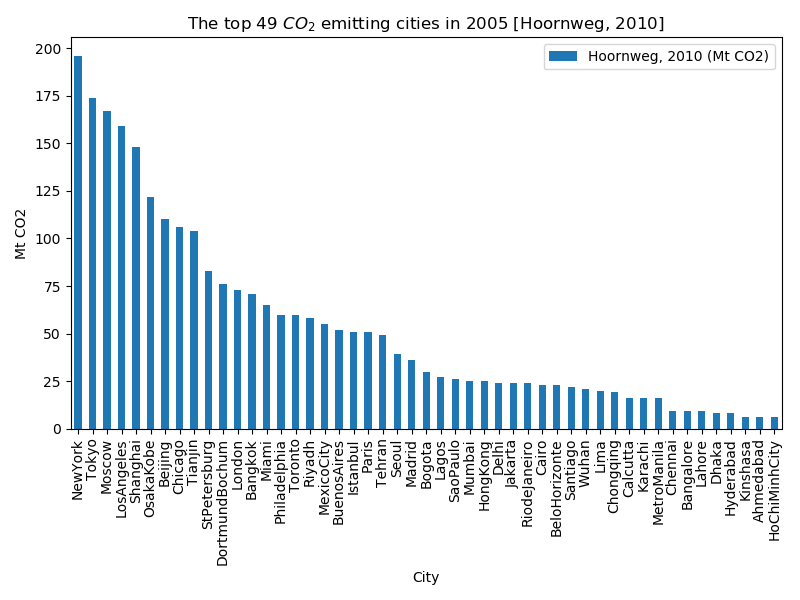

# Emissions data fun

A collection of script and Python packages to manipulate city emissions within a
global emissions dataset. 

## Dependencies / First steps

Before attempting to run scripts or use any code in this repository, you'll need to
download the required data with `git-lfs` and setup an environment with the required 
python dependencies. 

### Using `git-lfs` to get the data

In order to easily distribute the required data for these script, this repository 
uses `git-lfs` (Git Large File Support). `git-lfs` can be installed either before
or after cloning this repository, but will be needed in order to download the
required data. You can determine if you have `git-lfs` installed on your system by
running this command:  

```bash
command -v git-lfs
```

If you have `git-lfs` on your system, this command will print out the path to its
executable, otherwise it will not print anything. If `git-lfs` is not installed, 
you can install it by following the instructions here: 

https://git-lfs.github.com

Then, use the command

```bash
git lfs checkout
```

to download the required data.


### Setting up a python environment

We recommend using `conda` to manage your scientific computing environments, and 
as such, the below instructions assume you will be using `conda`. However, these 
dependencies should be relatively straightforward to adapt to your favorite
environment manager (e.g., `venv`, `pipenv`, `poetry`).

This code base requires Python 3.7+ and a number of common scientific python packages.
If you are using a **64-bit linux** machine, you can create an exact copy of the `conda`
environment used when developing these script with this command:

```bash
conda create --name MYENV --file conda_env.txt
```

or you are using a **Mac/Windows** or other type of machine, you can create a similar `conda` 
environment with this command:

```bash
conda create --name MYENV --file conda_env.yaml 
```

which will create a conda environment called `MYENV` and can be activated like:

```bash
conda activate MYENV
```

## Usage

There are currently a number of script here to to manipulate city emissions within a
global emissions dataset. All of these script are independent in that they do not 
require previous execution of another script, and all have their own command line 
interface (CLI). The scripts: 

* `visualize_city_emissions.py` -- A script with will display a contoured plot of the 
  selected global emissions dataset and the location of the top 49 cities, as well as
  barchart of the cities reported emissions from Hoornweg, 2010. The figures should 
  look like: 
  
  
  
  
    
* `clculate_city_emissions.py` -- A script which will calculate a cities emissions
  from N nearest neighbor grid cells from the global emissions dataset and compare 
  it to the cities reported emissions from Hoornweg, 2010.
  
* `intersect_city_emissions.py` -- A script which will calculate the specific emissions
  for a set of USA cities from N nearest neighbor grid cells from the global emissions 
  dataset, create a contour plot of the global emissions grid around the cities with the
  nearest neighbor cell boundaries outlined and the Landscan city boundaries outlined. 
  The figures should look like:
  
  
  
  
  
  
  
  
  
## Issues, questions, comments, etc.?
If you would like to suggest features, request tests, discuss contributions, report bugs, 
ask questions, or contact us for any reason, use the [issue tracker](https://code.ornl.gov/fjk/em-data/issues).

Want to send us a private message?

* Joseph H. Kennedy: `kennedyjh@ornl.gov`

Note: If you're emailing us, we recommend CC-ing all of us.